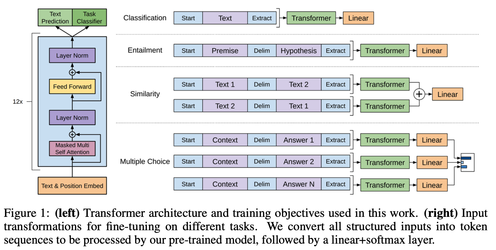

# GPT-1

!!! quote "Reference Paper"
    [Improving Language Understanding by Generative Pre-Training](https://www.mikecaptain.com/resources/pdf/GPT-1.pdf)

    **Author**: OpenAI
    
    **Date**: 2018

## 1 Framework

Our training procedure consists of two stages. The first stage is learning a high-capaciry language model on a large corpus of text. This is followed by a fine-tuning sage, where we adapt the model to a discriminative task with labeled data.

<figure markdown="span">
    {width="100%", loading=lazy}
</figure>

### 1.1 Unsupervised pre-training

Given an unsupervised corpus of tokens $\mathcal{U}=\{u_1,...,u_n\}$, we use a standard language modeling objective to maximize the following likelihood:

$$
L_1(\mathcal{U})=\sum_i \log P(u_i|u_{i-k},...,u_{i-1}; \Theta)
$$

where $k$ is the size of the context window, and the conditional probability $P$ is modeled using a neural network with parameters $\Theta$. These parameters are trained using stochastic gradient descent.

In GPT-1, we use a multi-layer *Transformer decoder* for the language model. This model applies a multi-headed self-attention operation over the input context tokens followed by position-wise feedforward layers to produce an output distribution over target tokens:

$$
\begin{aligned}
h_0&=UW_e+W_p \\
h_l&=\text{transformer\_block}(h_{l-1}) \quad \forall i \in [1,n] \\
P(u)&=\text{softmax}(h_nW_e^T)
\end{aligned}
$$

where $U=(u_{-k},...,u_{-1})$ is the context vector of tokens, $n$ is the number of layers, $W_e$ is the token embedding matrix, and $W_p$ is the position embedding matrix.

### 1.2 Supervised fine-tuning

We assume a labeled dataset $\mathcal{C}$, where each instance consists of a sequence of input tokens, $x^1,...,x^m$, along with a label $y$. The inputs are passed through our pre-trained model to obtain the final transformer block's activation $h_l^m$, which is then fed into an added linear output layer with parameters $W_y$ to predict $y$:

$$
P(y|x^1,...,x^m)=\text{softmax}(h_l^mW_y)
$$

This gives us the following objective to maximize:

$$
L_2(\mathcal{C})=\sum_{(x,y)}\log P(y|x^1,...,x^m)
$$

We additionally found that including language modeling as an auxiliary objective to the fine-tuning helped learning by:

- improving generalization of the supervised model
- accelerating convergence

Specifically, we optimize the following objective(with weight $\lambda$)

$$
L_3(\mathcal{C})=L_2(\mathcal{C})+\lambda * L_1(\mathcal{C})
$$

### 1.3 Task-specific input transformations

For some tasks, like classification, we can directly fine-tune our model as described above.

Certain other tasks, like question answering or textual entailment, have structured inputs such as ordered sentence pairs, or triplets of document, question, and answers. Since our pre-trained model was trained on contiguous sequences of text, we require some modifications to apply it to these tasks.

We use a traversal-style approach, where we convert structured inputs into an ordered sequence that our pre-trained architecture across tasks. All transformations include adding randomly initialized start and end tokens $(\langle s \rangle,\langle e \rangle)$.

1. **Textual entailment**
    For entailment tasks, we concatenate the premise $p$ and hypothesis $h$ token sequences, with a delimiter token ($) in between.

2. **Similarity**
    For similarity tasks, there is no inherent ordering of the two sentences being compared. To reflect this, we modify the input sequence to contain both possible sentence orderings(with a delimiter in between) and process each independently to produce two sequence representations $h_l^m$ which are added element-wise before being fed into the linear output layer.

3. **Question Answering and Commonsense Reasoning**
    For these tasks, we are given a vontext document $z$, a question $q$, and a set of possible answers $\{a_k\}$. We concatenate the document context and question with each possible answer, adding a delimiter token in between to get $[z;q;\$;a_k]$. Each of these sequences are processed independently with ourmodel and then mormalized via a softmax layer to proudce an output distribution over possible answers.