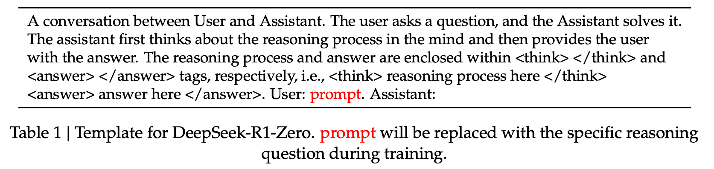
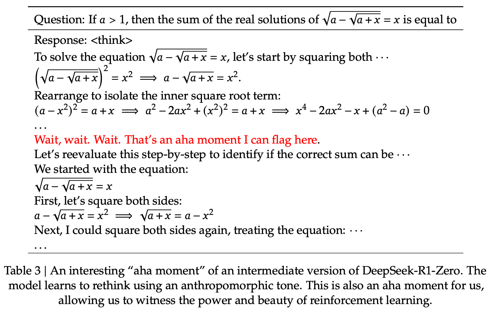

# DeepSeek-R1: Reinforcement Learning

!!! quote "Reference Paper"
    [DeepSeek-R1: Incentivizing Reasoning Capability in LLMs via Reinforcement Learning](https://arxiv.org/abs/2501.12948)

    **Author**: DeepSeek-AI

    **Date**: 22 Jan 2025

## 1 Overview

Previous work has heavily relied on large amounts of supervised data to enhance model performance. In this study, we demonstrate that reasoning capabilities can be significantly improved through large-scale reinforcement learning(RL), even without using supervised fine-tuning(SFT) as a cold start.
Furthermore, performance can be further enhanced with the inclusion of a small amount of cold-start data. We present:

1. **DeepSeek-R1_zero** applies RL directly to the base model without any SFT data
2. **DeepSeek-R1** applies RL starting from a checkpoint fine-tuned with thousands of long Chain-of-Thought(CoT) examples
3. Distill the reasoning capability from DeepSeek-R1 to small dense models

## 2 DeepSeek-R1-Zero

We explore the potential of LLMs to develop reasoning capabilities **without any supervised data**, focusing on their self-evolution through a pure reinforcement learning process. We start with a brief overview of our RL algorithm, followed by the presentation of some exciting results.

### 2.1 Reinforcement Learning Algorithm

##### Group Relative Policy Optimization

In order to save the training costs of RL, we adopt Group Relative Policy Optimization(GRPO), which foregoes the critic model that is typically the same size as the policy model, and estimates the baseline from group scores instead.

!!! note
    visit [GRPO](../GRPO/index.md) for detailed description

Specifically, for each question $q$, GRPO samples a group of outputs $\{o_1,o_2,...,o_G\}$ from the old policy $\pi_{\theta_{old}}$ and then optimizes the policy model $\pi_{\theta}$ by maximizing the following objective:

$$
\begin{aligned}
\mathcal{J}_{GRPO} &= \mathbb{E}[q\sim P(Q),\{o_i\}_{i=1}^{G}\sim \pi_{\theta_{old}}(O|q)] \\
&\frac{1}{G}\sum_{i=1}^G\left( \min\left(\frac{\pi_{\theta}}{\pi_{\theta_{old}}}A_i,\text{clip}\left(\frac{\pi_{\theta}(o_i|q)}{\pi_{\theta_{old}}(o_i|q)},1-\epsilon,1+\epsilon \right)A_i \right) -\beta \mathbb{D}_{KL}(\pi_{\theta}||\pi_{ref}) \right),
\end{aligned}
$$

$$
\mathbb{D}_{KL}(\pi_{\theta}||\pi_{ref})=\frac{\pi_{ref}(o_i|q)}{\pi_{\theta}(o_i|q)}-\log \frac{\pi_{ref}(o_i|q)}{\pi_{\theta}(o_i|q)}-1,
$$

where $\epsilon$ and $\beta$ are hyper-parameters, and $A_i$ is the advantage, computed using a group of rewards $\{r_1,r_2,...,r_G\}$ corresponding to the outputs within each group:

$$
A_i=\frac{r_i-\text{mean}(\{r_1,r_2,...,r_G\})}{\text{std}(\{r_1,r_2,...,r_G\})}
$$

### 2.2 Reward Modeling

To train DeepSeek-R1-Sero, we adopt a rule-based reward system that mainly consists of two type of rewards:

1. **Accuracy rewards**: The accuracy reward model evaluates whether the response is correct.

!!! example
    In the case of math problems with deterministic results, the model is required to provide the final answer in a specified format(e.g., within a box), enabling reliable rule-based verfication of correctness. Similarly, for LeetCode problems, a compiler can be used to generate feedback based on predefined test cases.

2. **Format rewards**: In addition to the accuarcy reward model, we employ a format reward model that enforces the model to put its thinking process between `<think>` and `</think>` tags. 

We do not apply the outcome or process neural reward model in developing DeepSeek-R1-Zero, because we find that the neural reward model may suffer from reward hacking in the large-scale reinforcement learning process, and retraining the reward model needs additional training resources and it complicates the whole training pipeline.

### 2.3 Training Template

<figure markdown="span">
    {width="100%", loading=lazy}
</figure>

To train DeepSeek-R1-Zero, we begin by designing a straightforward template that guides the base model to adhere to our specified instructions. As depicted in Tabel before, this template requires DeepSeek-R1-Zero to first produce a reasoning process, followed by the final answer. We intentionally limit our constraints to this structural format, avoiding any content-specific biases -- such as mandating reflective reasoning or promoting particular problem-solving strategies -- to ensure that we can accurately observe the model's natural progression during the RL process.

### 2.3 Evaluation

#### 2.3.1 Self-evolution Process of DeepSeek-R1-Zero

The thinking time of DeepSeek-R1-Zero shows consistent improvement throughout the training process. This improvement is not the result of external adjustments but rather an intrinsic development within the model. DeepSeek-R1-Zero naturally acquires the ability to solve increasingly complex reasoning tasks by leveraging extended test-time computation. This computation ranges from generating hundreds to thousands of reasoning tokens, allowing the model to eplore and refine its thought processes in greater depth.

#### 2.3.2 Aha Moment of DeepSeek-R1-Zero

<figure markdown="span">
    {width="100%", loading=lazy}
</figure>

A particularly intriguing phenomenon observed during the training of DeepSeek-R1-Zero is the occurrence of an "aha moment". This moment occurs in an intermediate version of the model. During the phase, DeepSeek-R1-Zero learns to allocate more thinking time to a problem by reevaluating its initial approach.

!!! note
    This moment underscores the power and beauty of reinforcement learning: rather than explicitly teaching the model on how to solve a problem, we simply provide it with the right incentives, and it autonomously develops advanced problem-solving strategies.

    The "aha moment" serves as a powerful reminder of the potential of RL to unlock new levels of intelligence in artificial systems, paving the way for more autonomous and adaptive models in the future.

#### 2.3.3 Drawback

For instance, DeepSeek-R1-Zero struggles with challenges like poor readability, and language mixing.

## 3 DeepSeek-R1

### 3.1 Cold Start

To prevent the early unstable cold start phase of RL training from the base model, for DeepSeek-R1 we construct and collect a small amount of long CoT data to fine-tune the model as the initial RL actor. 

In this work, we collect thousands of cold-start data to fine-tune the DeepSeek-V3-Base as the starting point for RL. Compared to DeepSeek-R1-Zero, the advantages of cold start data include:

- **Readability**: A key limitation of DeepSeek-R1-Zero is that its content is often not suitable for reading. Responses may mix multiple languages or lack markdown formatting to highlight answers for users. In contrast, when creating cold-start data for DeepSeek-R1, we design a readable pattern that includes a summary at the end of each response and filters out responses that are not reader-friendly. Here, we define the output format as `|special_token|<reasoning_process>|special_token|
`, where the reasoning process is the CoT for the query, and the summary is used to summarize the reasoning results.
- **Potential**: By carefully designing the pattern for cold-start data with human priors, we observe better performance against DeepSeek-R1-Zero. We believe the iterative training is a better way for reasoning models.

### 3.2 Reasoning-oriented Reinforcement Learning

After fine-tuning DeepSeek-V3-Base on the cold start data, we apply the same large-scale reinforcement learning training process as employed in DeepSeek-R1-Zero.

During the training process, we observe that CoT often exhibits language mixing, particularly when RL prompts involve multiple languages. To mitigate the issue of language mixing, we introduce a language consistency reward during RL training, which is calculated as the proportion of target language words in the CoT. Finally, we combine the accuracy of reasoning tasks and the reward for language consistency by directly summing them to form the final reward. We then apply RL training on the fine-tuned model until it achieves convergence on reasoning tasks.

!!! note
    Although ablation experiments show that such alignment results in a slight degradation in the model’s performance, this reward aligns with human preferences, making it more readable. And we called this **Reasoning-oriented Reinforcement Learning**(RORL).

### 3.3 Rejection Sampling and Supervised Fine-Tuning

Unlike the initial cold-start data, which primarily focuses on reasoning, this stage incorporates data from other domains to enhance the model’s capabilities in writing, role-playing, and other general-purpose tasks.

#### Reasoning data

We curate reasoning prompts and generate reasoning trajectories by performing rejection sampling from the checkpoint from the above RL training. In this stage, we expand the dataset by incorporating additional data, some of which use a generative reward model by feeding the ground-truth and model predictions into DeepSeek-V3 for judgment.

#### Non-Reasoning data

For non-reasoning data, such as writing, factual QA, self-cognition, and translation, we adopt the DeepSeek-V3 pipeline and reuse portions of the SFT dataset of DeepSeek-V3. For certain non-reasoning tasks, we call DeepSeek-V3 to generate a potential chain-of-thought before answering the question by prompting.

### 3.4 Reinforcement Learning for all Scenarios

To further align the model with human preferences, we implement a secondary reinforcement learning stage aimed at improving the model’s helpfulness and harmlessness while simultaneously refining its reasoning capabilities. Specifically, we train the model using a combination of reward signals and diverse prompt distributions.

For reasoning data, we adhere to the methodology outlined in DeepSeek-R1-Zero, which utilizes rule-based rewards to guide the learning process in math, code, and logical reasoning domains.

For general data, we resort to reward models to capture human preferences in complex and nuanced scenarios.

