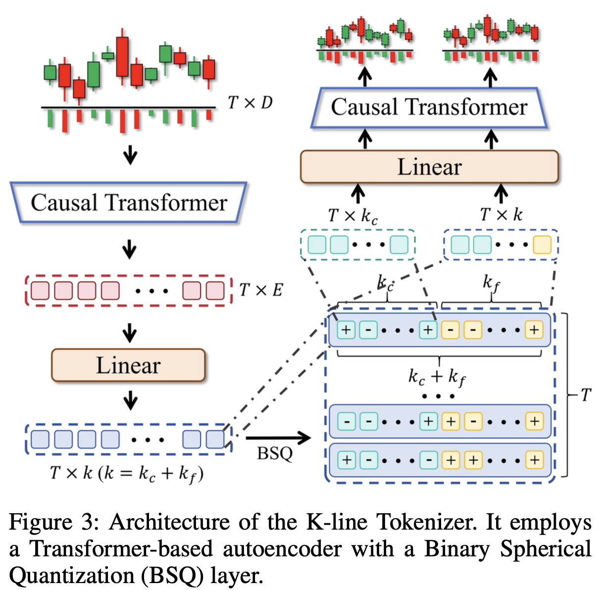
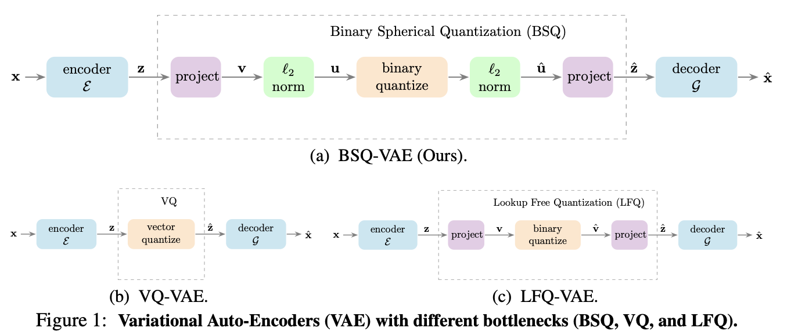
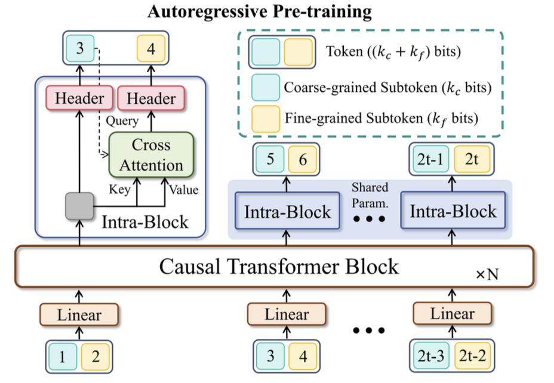
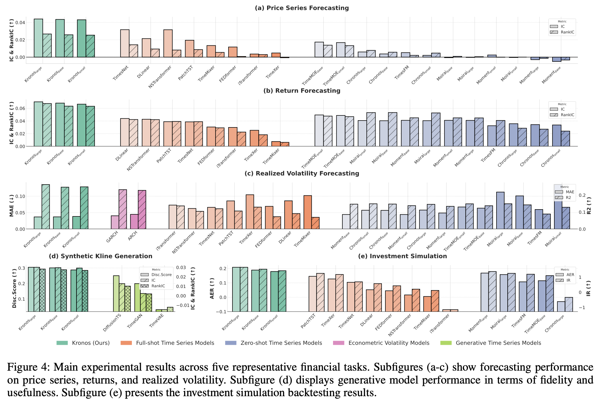

# Kronos: A Foundation Model for the Language of Financial Markets

!!! quote "Reference Paper"
    **[Kronos: A Foundation Model for the Language of Financial Markets](https://arxiv.org/abs/2508.02739)**
    
    **Author**: Department of Automation Tsinghua University
    
    **Date**: 2 Aug 2025

!!! Abstract
    The success of large-scale pre-training paradigm, exemplified by Large Language Models (LLMs), has inspired the development of Time Series Foundation Models (TSFMs). However, their application to financial candlestick (K-line) data remains limited, often underperforming non-pre-trained architectures. Moreover, existing TSFMs often overlook crucial downstream tasks such as volatility prediction and synthetic data generation. To address these limitations, we propose **Kronos, a unified, scalable pre-training framework tailored to financial K-line modeling**. Kronos introduces a specialized tokenizer that discretizes continuous market information into token sequences, preserving both price dynamics and trade activity patterns. We pre-train Kronos using an autoregressive objective on a massive, multi-market corpus of over 12 billion K-line records from 45 global exchanges, enabling it to learn nuanced temporal and cross-asset representations. Kronos excels in a zero-shot setting across a diverse set of financial tasks. On benchmark datasets, Kronos boosts price series forecasting RankIC by 93% over the leading TSFM and 87% over the best non-pre-trained baseline. It also achieves a 9% lower MAE in volatility forecasting and a 22% improvement in generative fidelity for synthetic K-line sequences. These results establish Kronos as a robust, versatile foundation model for end-to-end financial time series analysis. Our pre-trained model is publicly available at https://github.com/shiyu-coder/Kronos.

## 1. Introduction

Financial markets is a critical and challenging application area for TSFMs, given their inherent data richness, high-frequency observations, and complex, non-stationary temporal dynamics. At the core of this domain are K-line sequences, multivariate time series derived from candle-stick charts that record **O**pen, **H**igh, **L**ow, and **C**lose prices, along with trading **V**olume and **A**mount(Turnover) over fixed intervals(**OHLCVA**). These sequences constitute a highly compact, information-dense "language" through which market participants interpret prices movements, volatility regimes, liquidity shifts, and colletive sentment.

## 2. Motivation
Despite the promise of TSFMs. Old application to finance faces significant hurdles.

1. Unique statistical properties of K-line data
	- Low signal-to-noise ratio, strong non-stationarity, and complex interdependencies among OHLCVA features.
	- These properties are poorly aligned with the inductive biases of general-purpose TSFMs.
2. Underserved financial domain in pre-training
    - Most TSFMs are trained on broad, multi-domain corpora where financial data accounts for only a tiny fraction.
	- As a result, financial-specific dynamics are overlooked or averaged out.
3. Task gaps
	- Critical finance-specific tasks such as volatility prediction, synthetic data generation, and risk management remain largely unaddressed by existing TSFMs.

Empirical evidence shows that general-purpose TSFMs often underperform even non-pre-trained, specialized models (like iTransformer) on financial tasks. This reveals a gap: the field lacks a foundation model built specifically for financial time series.

## 3. Preliminary
Let $D$-dimensional vector $x_t \in \mathbb{R}^D$ denote the K-line observation at discrete time $t$, comprising $D$ key financial indicators. In this work, the dimension was fixed $D=6$ to represent OHLCVA attributes. Given a historical sequence $x_{1:T}=(x_1,x_2,...,x_T)$, our objective is to predict the following $H$ observations $\hat{x}_{T+1:T+H}=(\hat{x}_{T+1}, \hat{x}_{T+2},...,\hat{x}_{T+H})$.

Rather than operating on raw continuous inputs, Kronos first quantizes each multivariate observation $x_t$ into a discrete token $b_t$ via a learnable codebook $\mathcal{C}$. Consequently, the original sequence $x_{1:T}=(x_1,x_2,...,x_T)$ is mapped to $b_{1:T}=(b_1,...,b_T)$. The forecasting task then reduces to an autoregressive token-sequence modeling problem:

$$
p(\mathbf{b}_{T+1:T+H}|\mathbf{b}_{1:T}) = \sum_{h=1}^{H} p(b_{T+h}|\mathbf{b}_{1:T+h-1})
$$

## 4. Methodology

Kronos implements this via a two-phase framework: **(1) K-line Tokenization** and **(2) Autoregressive Pre-training**

### 4.1 K-line Tokenization

<figure markdown="span">
    {width="50%", loading=lazy}
</figure>

The tokenization is achieved using a Transformer-based autoencoder composed of an encoder $E_{\text{enc}}$, a quantizer $Q$, and a decoder $E_{\text{dec}}$.

Kronos adapt Binary Spherical Quantization(BSQ) for this task. BSQ quantizes a continuous latent vector $\xi_t$ into a $k$-bit binary code $b_t \in \{-1,1\}^k$ by projecting it onto a set of learnable hyperplanes.

#### 4.1.1 Introduction to BSQ

!!! quote "Related Paper"
    **[Image and Video Tokenization with Binary Spherical Quantization](https://arxiv.org/abs/2406.07548)**

<figure markdown="span">
    {width="100%", loading=lazy}
</figure>

Binary Spherical Quantization (BSQ) optimizes over an implicit codebook $\textbf{C}_{BSQ}=\{-\frac{1}{\sqrt{L}}, \frac{1}{\sqrt{L}}\}^L$, a hypercube projected onto a unit sphere. Each corner $\textbf{c}_k \in \textbf{C}_{BSQ}$ of a hypercube corresponds to a unique token $k$. The quantizer works as follows: it projects some high-dimensional latent embedding $\textbf{z}$ to a lower-dimensional unit hypersphere $\textbf{u}$, applies binary quantization per axis $\hat{\textbf{u}}=sign(\textbf{u})$ and back-projects to the quantized vector in the original latent space $\hat{\textbf{x}}$.
Specifically, we start with an encoded visual input $\textbf{z}=\mathcal{E}(\textbf{x}) \in \mathbb{R}^d$. We first linearly project the latent embedding to $L$ dimensions $\textbf{v} = Linear(\textbf{z}) \in \mathbb{R}^L$, where $L \ll d$. Next, we obtain project $\textbf{v}$ onto the unit sphere $\textbf{u}=\frac{\textbf{v}}{|\textbf{v}|}$ and perform binary quantization to each dimension of $u$ independently $\hat{\textbf{u}}=\frac{1}{\sqrt{L}} sign(\textbf{\textbf{u}})$, where $sign(x)$ is the sign function. To keep outputs on the unit sphere, we map $sign(0) \rightarrow 1$. We use a Straight-Through Estimator (STE) make the operator differentiable, $sign_{STE}(x) = sg(sign(x)−x) + x$, where $sg(·)$ denotes the stop-gradient operation. Finally, we back-project the quantized $\hat{\textbf{u}}$ to the $d$-dimensional space $\hat{\textbf{z}} = Linear(\hat{\textbf{u}}) \in \mathbb{R}^d$.

#### 4.1.2 Effectiveness of BSQ
The effectiveness of BSQ tokenizer can be analyzed from two key perspectivs: its inherent noise suppression and its ability to create a structured, discrete state space suitable for sequence modeling.
##### Noise Suppression And Stability
BSQ's projection of embeddings onto a unit sphere prior to binarization guarantees that the expected distortion is strictly upper-bounded:

$$
\mathbb{E}_u\|u-\hat{u}\| < \sqrt{2-\frac{2}{\sqrt{L}}} < \sqrt{2}
$$

This bound tightens as the codebook dimension $L$ increases. In contrast, simple methods like sign-based quantization without normalization(e.g., LFQ) lack such a guarantee, leaving them vulnerable to arbitarily large errors from outlier inputs.

##### Learning in a Compact and Discrete State Space
High-frequency financial data exists in a high-dimensional, continuous state space. This tokenizer maps these in a finite, discrete vocabulary of tokens. This discretization serves as a powerful form of regularization with two main benefits.

**Inproved Sample Efficiency and Generalization**: Instead of learning a complex function over a continuous space, a downstream model like a Transformer learns to predict transitions and patterns among a finite set of abstract states(tokens). This simplifies the learning tasks and also allows the model to learn robust patterns from fewer examples, which is particularly critical for modeling rare market phenomena.

**Reduced Overfitting**: The quantization process inherently discards fine-grained, potentially noisy variations within each quantization cells. This prevents the model from fitting to spurious artifacts in the tarining data.

##### Hyperspherical geometry for tail sensitivity
In financial contexts, market returns and price changes often exhibit heavy tails(or fat tails). The heavy-tail distribution of price changes is one of the key sources of trading profits in quantitative investment and cannot be ignored.

Unlike standard vector-quantization on the Euclidean sphere, BSQ's binary encoding preserves angular information very efficiently, making it more sensitive to fat-tail data that manifest as sharp directional changes in feature space. This aligns well how microstructure events often appear as abrupt shifts in the "direction" of the joint price-volume vector.

#### 4.1.3 Subtoken Factorization
While a large number of bits $k$ (e.g., $k=20$) is desirable for capturing rich financial patterns, it results in an exponentially large vocabulary of size $2^k$. To mitigate this, we use the subtoken factorization and factorize the $k$-bit code into $n$ subspaces. Motivated by the trade-off between parameter savings and latency costs, we set $n=2$. We partition the code into a coarse subtoken $b_t^c$ and a fine subtoken $b_t^f$ of equal bit length. The resulting code $b_t$ is a concatenation of these two subtokens: $b_t=[b_t^c,b_t^f]$.

We train the tokenizer with a composite objective that combines a hierachical reconstruction loss and a commitment loss for BSQ:

$$
\mathcal{L}_{\text{tokenizer}} = \mathcal{L}_{\text{coarse}} + \mathcal{L}_{\text{fine}} + \lambda \mathcal{L}_{\text{quant}}
$$

where $\lambda$ is a balancing hyperparameter. The components are defined as:

- $\mathcal{L}_{\text{coarse}}=\mathbb{E}[\|\textbf{x}-E_{\text{dec}}(\textbf{b}^c)\|^2]$, which trains the coarse subtoken $\textbf{b}^c$ to form a low-fidelity reconstruction.
- $\mathcal{L}_{\text{fine}}=\mathbb{E}[\|\textbf{x}-E_{\text{dec}}(\textbf{b})\|^2]$, which evaluates the high-fidelity reconstruction using the complete token $\textbf{b}$.
- $\mathcal{L}_{\text{quant}}$ is the quantization loss from BSQ that regularizes the learning process. It penalizes the L2 distance between continuous latent vector $\xi$ and their binary codes $\textbf{b}$, aligning the encoder's outputs with the learned codebook to ensure stable training.

### 4.2 Hierarchical Autoregressive Modeling

<figure markdown="span">
    {width="70%", loading=lazy}
</figure>

The primary objective is to estimate the joint distribution over the token sequence $\textbf{b}=\{b_1,...,b_r\}$. A simplified form of Equation 1 can be derived as:

$$
p(\textbf{b}) = \sum_{t=1}^Tp(b_t|\textbf{b}_{<t})
$$

where $\textbf{b}_{<t}$ denotes all preceding tokens up to time $t-1$.

Given the hierarchical token design, in which each token is structured as $b_t=[b_t^c,b_t^f]$, we further decompose the conditional probability using the chain rule to explicitly capture the inherent coarse-to-fine dependency:

$$
p(b_t|\textbf{b}_{<t})=p(b_t^c|\textbf{b}_{<t}) \cdot p(b_t^f|\textbf{b}_{<t}, b_t^c)
$$

At time $i$, the subtokens $b_i^c$ and $b_i^f$ are independently projected into vector representations using two **distinct** embedding layers, resulting in representations $e_c(b_i^c)$ and $e_f(b_i^f)$, respectively. These embeddings are then concatenated and linearly projected to produce a fused input vector:

$$
\text{v}_i = W_{fuse}([e_c(b_i^c); e_f(b_i^f)])
$$

where $[\cdot ; \cdot]$ denotes concatenation, and $W_{fuse}$ is a learnable weight matrix responsible for projecting the combined representaion into the model's latent space.

#### Coarse Subtoken Prediction

The history vector $\textbf{h}_t$ is projected by a linear head $W_c$ to produce logits for the first subtoken's distribution:

$$
p(b_t^c|\textbf{b}_{<c})=\text{softmax}(W_c\textbf{h}_t)
$$

#### Fine Subtoken Prediction
During the trainiing, we use the model's own prediction from the previous step, $\hat{b}_t^c$, which is sampled from the predicted distribution $p(b_t^c|\textbf{b}_{<t})$, rather than using the ground-truth subtoken(i.e., teacher-forcing). We use a cross-attention mechanism where the embedding of $\hat{b}_t^c$ acts as the query, and the history $\textbf{h}_t$ provides the key and value. The result is projected by the second head $W_f$:

$$
\textbf{h}_t^{\text{update}} = \text{CrossAttn}(q=e_c(\hat{b}_t^c), k=v=\textbf{h}_t)
$$

$$
p(b_t^f|\textbf{b}_{<t},b_t^c)=\text{softmax}(W_f\textbf{h}_t^{\text{update}})
$$

The overall training objective $\mathcal{L}_{ar}$ is the negative log-likelihood of the data, summed over both prediction steps:

$$
\mathcal{L}_{\text{ar}}=-\mathbb{E}_{\textbf{b}\sim\mathcal{D}} \sum_{t=1}^T\left[\log p(b_t^c|\textbf{b}_{<t})+\log p(b_t^f|\textbf{b}_{<t}, b_t^c)\right]
$$

where $\mathcal{D}$ represents the data distribution.

## 5. Results and Conclusion

<figure markdown="span">
    {width="100%", loading=lazy}
</figure>