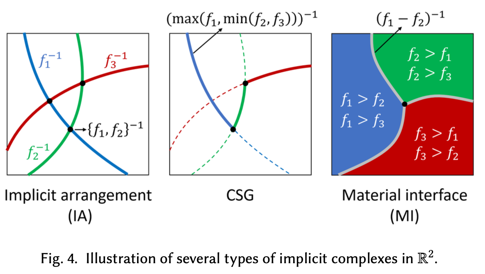
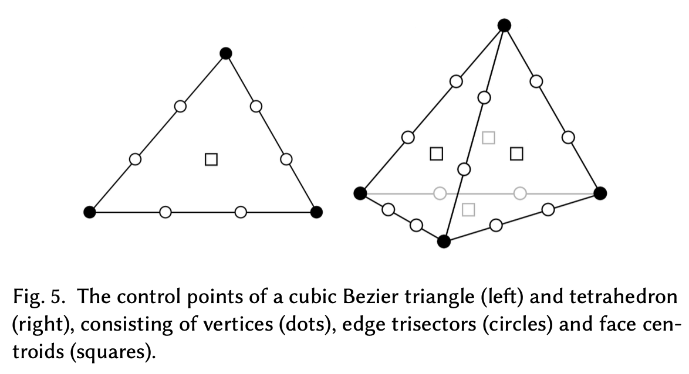
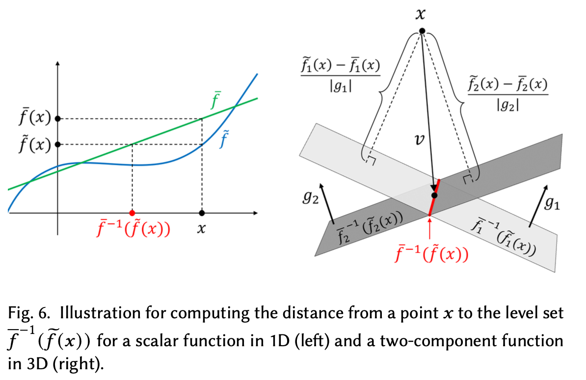
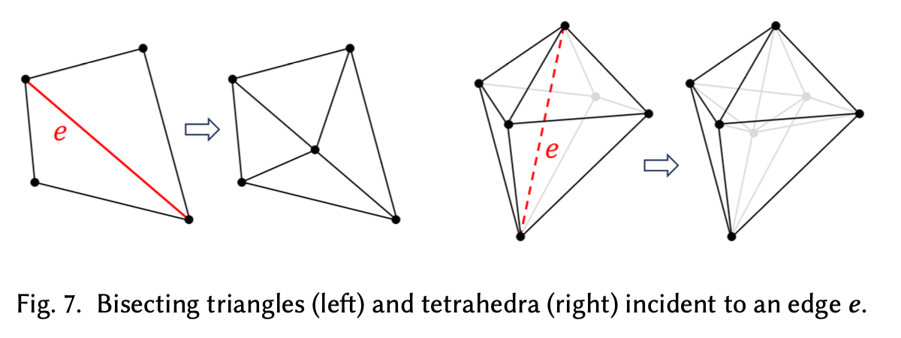
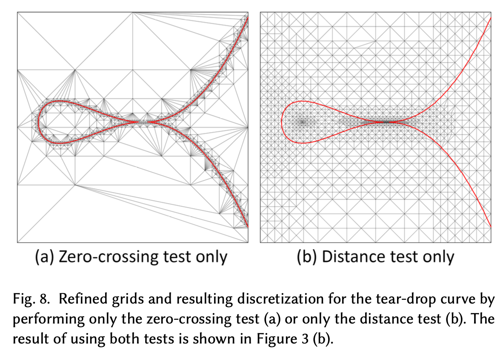
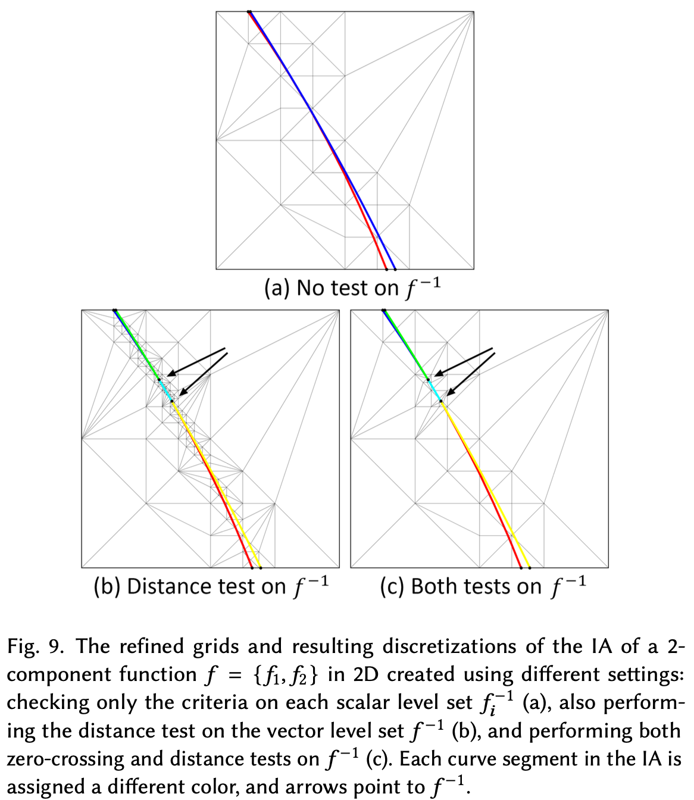
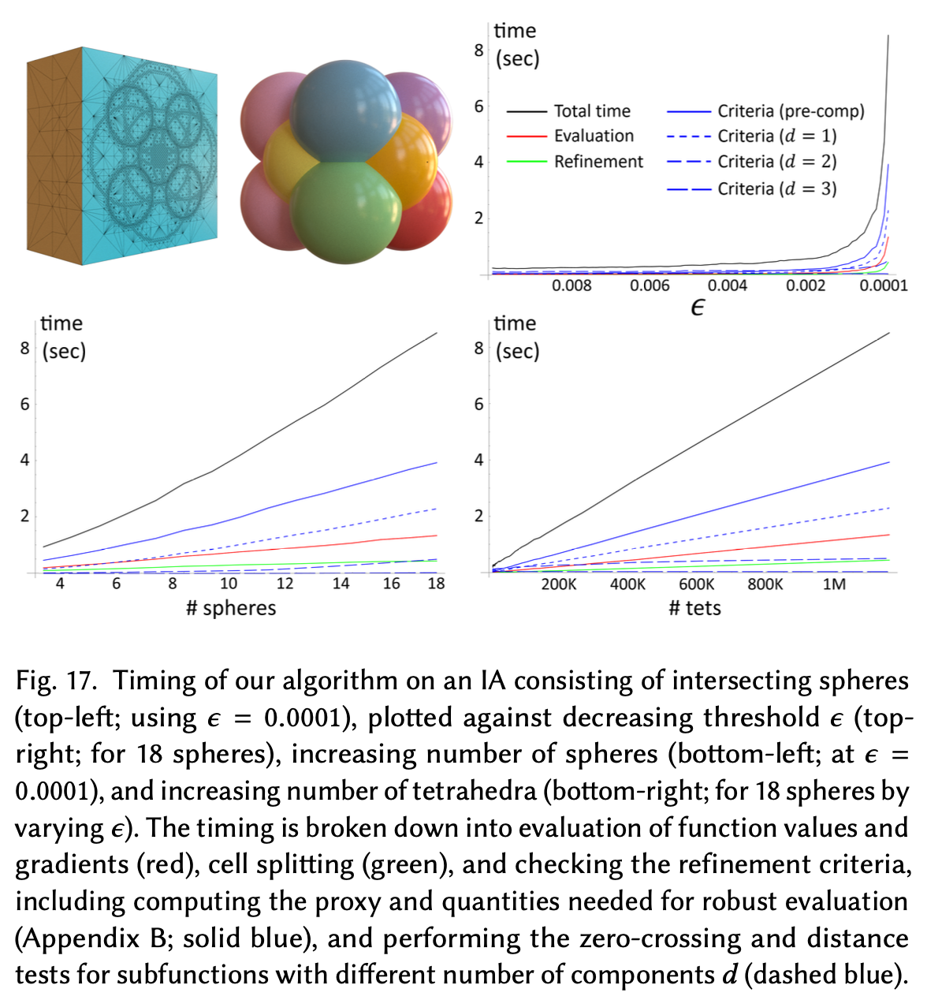

# Adaptive grid generation for discretizing impliit complexes

!!! quote
    **[Adaptive grid generation for discretizing implicit complexes](https://dl.acm.org/doi/10.1145/3658215)**

    **date**: 19 Jul 2024

## 1 Introduction
Implicit representations are widely used in computer graphis. A smooth and manifold surface in 3D can be represented as the level set of a scalar function $f:\mathbb{R}^3 \rightarrow \mathbb{R}$, also known as an *implicit surface*. The implicit surface enjoys a number of benefits, including a simple definition, easy modification, and convenience for operations such as offsets and boolean.

To be useful for downstream applications, an implicit surface or complex must be discretized. An ideal grid for discretization should be *adaptive* in that the finer grid cells are typically where the implicit shape has a non-trival geometry or topology.

While adaptive grid generatioin has been extensively studied for polygonizing implicit surfaces, works on implicit complexes have been scarce. A key challenge in the latter is adapting the grid structure to accuartely discretize the *intersection* of multiple implicit surface.

## 2 Preliminaries

### 2.1 Level sets and zero sets

<figure markdown="span">
    {width="70%", loading=lazy}
</figure>

The *Level set* of a scalar function $f:\mathbb{R}^n \rightarrow \mathbb{R}$ at level $s \in \mathbb{R}$ which we denote by $f^{-1}(s)$, is the loci of points where $f$ evaluates to $s$:

$$
f^{-1}(s) = \{x\in \mathbb{R}^n | f(x)=s\}
$$

We call the level set $f^{-1}(0)$ the zero set, which we abbreviate as $f^{-1}$.

This definition naturally generalizes to the level set of a vector-valued function $f:\mathbb{R}^n \rightarrow \mathbb{R}^m$, where $m > 1$, as the loci of points where $f$ evaluated to a vectro level $s$. Note that $f$ can be considered as a set of $m$ scalar functions $\{f_1,...,f_m\}$, which we called the *components* of $f$. Geometrically, $f^{-1}(s)$ is the *intersection* of the $m$ scalar level sets of its components,

$$
f^{-1}(s) = \bigcap_{i=1}^{m}f_i^{-1}(s_i)
$$

where $s=\{s_1,...,s_m\}$. As a result, $f^{-1}(s)$ is a $(n-m)$-dimensional manifold, and it generally only exists for $m \le n$.

## 3. Refinement criteria for zero set

Our criteria answer the following general question: given a function $f:\mathbb{R}^n \rightarrow \mathbb{R}^m$ for any dimension $n$ and $m \in [1,n]$ and an $n$-simplex $t$, does $t$ need to be refined to better discretize the zero set $f^{-1}$.

!!! tip "Sepcial Case"
    In $\mathbb{R}^3$, our criteria consider a single implicit surface($m=1$), the intersection curve of two surfaces($m=2$), or the interserction point of three surfaces($m=3$).

Our criteria follow the same principles as existing ones for implicit surfaces. That is, refinement is not needed if either $t$ does not contain any part of $f^{-1}$, or if $f^{-1}$ is already close enough to the discretization. Specifically, let $\bar{f}$ be the linear approximation of $f$ inside $t$ by barycentric interpolation of values of $f$ at the vertices of $t$. We consider the zero set of $\bar{f}$, $\bar{f}^{-1}$, as the discretization of $f^{-1}$ in $t$. We deem $t$ refinable for $f^{-1}$ if it passes two tests:

- Zero-crossing test:

    $$
    f^{-1} \cap t \ne \emptyset
    $$

- Distance test:

    $$
    d_H(f^{-1} \cap t, \bar{f}^{-1}) > \epsilon
    $$

    where $d_H(X, Y) = \text{sup}_{x\in X}d(x,Y)$ is the one-sided Hausdorff distance from $X$ to $Y$, and $\pesilon$ is a user-defined threshold.

### 3.1 Proxy construction

We consider the calss of functions $\tilde{f}$ represented as a *convex combination with linear precision* as our proxy. Such a function is defined by *control points* $p_1,...,p_l$ that lie inside or on the boundary of the simplex $t$, where each $p_i$ is associated with a *control value* $b^i=\{b_1^i,...,b_m^i\}$. The function, $\tilde{f}$, is a weighted average of $b^i$,

$$
\tilde{f}(x)=\sum_{i=1}^{l}w_i(x)b^i
$$

where the weights $w_i(x)$ satisfy, for all $x \in t$:

1. Convexity: $w_i(x) \ge 0$ for $i = 1,...,l$, and $\sum_{i=1}^lw_i(x)=1$
2. Linear precision: $\sum_{i=1}^lw_i(x)p_i=x$

A example of such $\tilde{f}$ is the *Bezier simplex*, where the control points lie on a regular grid in $t$ and the weights $w_i$ are Berstein polynoials. In our implementation, we adopt the *cubic Bezier simplex* as the proxy. The control points $p_i$ in a cubic Bezier simplex consist of all vertices of $t$, the two trisector on each edge of $t$, and the centroid of each triangle face of $t$.

<figure markdown="span">
    {width="60%", loading=lazy}
</figure>

!!! note "Cubic Bezier Simplex"
    The control points $p_1,...,p_l$ in an $n$-dimensional cubic Bezier simplex $t$ include the vertices, edge trisectors, and face centroids of $t$. The barycentric coordinates(w.r.t. to the $n+1$ vertices of $t$) at each control points $p_i$ thus have the form $\{\lambda_1^i,...,\lambda_{n+1}^i\}/3$, where each $\lambda_j^i\in \{0,1,2,3\}$ and $\sum_{j=1}^{n+1}\lambda_j^i=3$. The Bernstein polynomials $w_i(x)(i=1,...,l)$ for any $x\in t$ has the form:

    $$
    w_i(x)=\frac{3!}{\lambda_1^i!\,\cdots\,\lambda_{n+1}^i!}\beta_1(x)^{\lambda_1^i}\,\cdots\,\beta_{n+1}(x)^{\lambda_{n+1}^i}
    $$

    where $\beta_j(x)$ is the $j$-th barycentric coordinate of $x$.

    We obtain the control values $b^1,...,b^l$ following the "nine parameter interpolant" method. Specifically, let $f(q)$ and $\nabla f(q)$ be the value and gradient at a vertex $q$,

    - If $p_i$ is a vertex of $t$ then $b^i=f(p_i)$.
    - If $p_i$ is a trisector of edge $\bar{p_jp_k}$ and closer to $p_j$, then

        $$
        b^i=b^j+\frac{1}{3}\nabla f(p_j)\cdot (p_k-p_j)
        $$
    
    - If $p_i$ is the centroid of a triangle with vertices $V$ and edge trisectors $E$, then

        $$
        b^i=\frac{1}{4}\sum_{p_j\in E}b^j-\frac{1}{6}\sum_{p_j\in V}b^j
        $$
    
    Note that the control values $b^i$ at the triangle centroids do not affect the interpolation of the given values and gradients. The choices made above have the property that the resulting interpolant reproduces all polynomial $f$ up to quadratics.
### 3.2 Zero-crossing test

We now examine the refinement criteria on a proxy function $\tilde{f}$. The value $\tilde{f}(x)$ at any point $x \in t$ lies in the $m$-dimensional convex hull of $b$. As a result, if there exists some points $x$ such that $\tilde{f}(x)=0$, then $0$ lies in this convex hull. So a necessary condition to pass the zero-crossing test is

$$
O \in CH(b)
$$

where $O$ is the origin of $\mathbb{R}^m$ and $CH(b)$ is the convex hull of $b$.

### 3.3 Distance test

We next turn to the distance test on the proxy $\tilde{f}$, which check if

$$
d_H(\tilde{f}^{-1}\cap t, \bar{f}^{-1}) > \epsilon
$$

where $\bar{f}$ is the linear approximation of $f$ in $t$. We observe that the exact Hausdorff distance has the following upper bound:

$$
\begin{aligned}
d_H(\tilde{f}^{-1} \cap t, \overline{f}^{-1}) 
&= \max_{x \in \tilde{f}^{-1}\cap t} d(x, \overline{f}^{-1}(0)) \\
&= \max_{x \in \tilde{f}^{-1}\cap t} d(x, \overline{f}^{-1}(\tilde{f}(x))) \\
&\leq \max_{x \in t} d(x, \overline{f}^{-1}(\tilde{f}(x)))
\end{aligned}
$$

In other words, the upper bound is the maximal distance from any point $x \in t$ to the *level set* of the linear function $\bar{f}$ at the level $\tilde{f}(x)$.

<figure markdown="span">
    {width="70%", loading=lazy}
</figure>

We first consider the simple case of $m=1$. Since $\bar{f}$ is a scalar function, its level sets are $(n-1)$-dimensional hyperplane in $\mathbb{R}^n$ orthogonal to the gradient $g=\nabla \bar{f}$. The distance from $x$ to the level set of $\bar{f}$ at level $\tilde{f}(x)$ is $\frac{\tilde{f}(x)-\bar{f}(x)}{|g|}$ (assuming $g\ne 0$).

Now consider $m > 1$. The vector level set $\bar{f}^{-1}(\tilde{f}(x))$ is the intersection of $m$ scalar level sets $\bar{f}^{-1}_i(\tilde{f}_i(x))$, each being a hyperplane orthogonal to a gradient vector $g_i=\nabla \bar{f}_i$. Let $v$ be the vector from $x$ to its nearest point on this intersection. We can therefore find $v$ as

$$
v = M(\tilde{f}(x)-\bar{f}(x))
$$

where $M=g(g^Tg)^{-1}$

Since linear transformations(such as $M$) preserve convexity, $v$ lies in this convex hull of the transformed points $M(b-\bar{b})$. Finally, we arrive at the bound:

$$
d(x, \bar{f}^{-1}(\tilde{f}(x))) = |v| = |M(\tilde{f}(x)-\bar{f}(x))| \le \max_{i=1,...,l}|M(b^i-\bar{b}^i)|
$$

Therefore, a necessary condition to pass the distance test is

$$
\max_{i=1,...,l}|M(b^i-\bar{b}^i)| > \epsilon
$$

## 4. Simplicial refinement

Our implementation is specialized for the practically useful cases of $n=2,3$. Our method is a variation of the calssical *longest edge bisection*(LEB) method.

<figure markdown="span">
    {width="60%", loading=lazy}
</figure>

For any chosen edge $e$, we bisect $all$ cells incident to $e$ at the mid-point of $e$, regardless of whether $e$ is the longest edge of that cell. Specifically, we call an edge *refinable* if any of its incident cells is refinaable according to the given refinement criteria. At each iteration of the algorithm, we bisect the longest refinable edge in the current grid. We call our method the *longest refinable edge bisection*(LREB) method.

!!! note
    This method lack a theoretical bound. But experimental evidence is provided to show that the worst quality among cells enclosing the implicit shape produced by LREB appears to be lower-bound for a variety of implicit surfaces and complexes.

## 5. Result

### 5.1 Zero-crossing and distance test

We first examine the tests on a scalar zero set whose implicit field is $f(x,y)=x^5+x^4-2y^2$

<figure markdown="span">
    {width="70%", loading=lazy}
</figure>

We then examine the tests on vector zero sets. We start with a 2-component function $f=\{f_1,f_2\}$ whose implicit curves are circles with large radius and are almost tangent at their intersection points.

<figure markdown="span">
    {width="80%", loading=lazy}
</figure>

### 5.2 Performance

<figure markdown="span">
    {width="80%", loading=lazy}
</figure>

Observe that the running time is dominated by evaluating the function values and gradients at the grid points(red) and checking the criteria(blue), and the latter in turn is dominated by computing the proxy(solid line) and performing the tests on implicit surfaces(short dashes).
