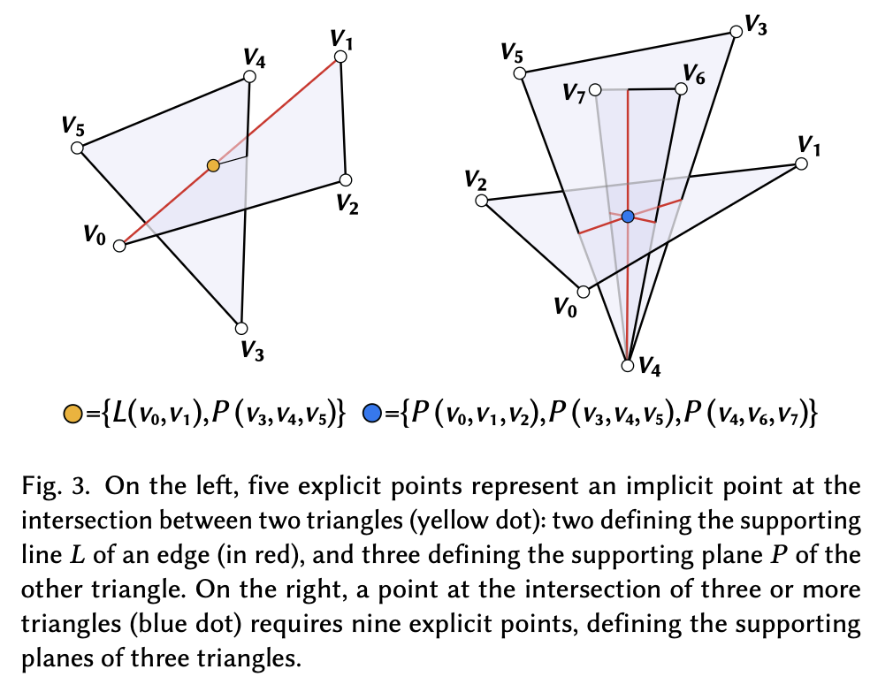

# Fast and Robust Mesh Arrangements using Floating-point Arithmetic

!!! quote
    **[Fast and Robust Mesh Arrangements using Floating-point Arithmetic](https://dl.acm.org/doi/abs/10.1145/3414685.3417818)**

    **date**: 27 Nov 2020

!!! Abstract
    We introduce a novel algorithm to transform any generic set of triangles in 3D space into a well-formed simplicial complex. Intersecting elements in the input are correctly identified, subdivided, and connected to arrange a valid configuration, leading to a topologically sound partition of the space into piece-wise linear cells. Our approach does not require the exact coordinates of intersection points to calculate the resulting complex. We represent any intersection point as an unevaluated combination of input vertices. We then extend the recently introduced concept of indirect predicates to define all the necessary geometric tests that, by construction, are both exact and effcient since they fully exploit the floating-point hardware. This design makes our method robust and guaranteed correct, while being virtually as fast as non-robust floating-point based implementations. Compared with existing robust methods, our algorithm o$ers a number of advantages: it is much faster, has a better memory layout, scales well on extremely challenging models, and allows fully exploiting modern multi-core hardware with a parallel implementation. We thoroughly tested our method on thousands of meshes, concluding that it consistently outperforms prior art. We also demonstrate its usefulness in various applications, such as computing effcient mesh booleans, Minkowski sums, and volume meshes.

## 1 Problem Statement
Consider a generic set of triangles $T$ with no assumptions, and identify their *arrangement* in space, that is, a subdivision of the space in cells bounded by the input triangles. To explicitly represent the bounding surface of each cell we subdivide intersecting triangles, thus constructing new points to represent the intersections and connecting them to form the sub-triangles.

We achieved this result by first cleaning $T$ from degenerate(null area) elements, and then resolving all the intersections on the remaining triangles, thus producing a modified set $T'$. Therefore, triangles in $T'$ are not only geometrically coincident with $T$ but also from a valid simplicial complex, meaning that they are either disjoint or connected through a shared sub-simplex(i.e., they have an edge or vertex in common).

The most critical part of the computation of an arrangement is the representation of points of intersection.

## 2 Main Contribution

Main contribution is a novel method to robustly reconstruct the subdivided triangles $T'$ without using the coordinates of intersection points. In the method, indeed, these points are implicitly represented in terms of the input geometic entities that generated them. Their relative positions, the program flow and the connectivity of $T'$ are robustly determined by a novel set of exact geometric predicates.

## 3 Representation and Processing

Our *implicit* intersection points keep the memory of the supporting planes and lines of the triangles and edges that generated them, and the vertices of the supporting entities are part of the input, hence exact.

Using an explicit representation, this is a relatively simple task to discover the relative position of all the intersection points for existing mesh elements, but for an implicit representation, it's not that obviously. So, we will implement these core functionalities for sets of implicit points, as well as for hybrid sets made by both implicit and explicit points later.

### 3.1 Point representation

<figure markdown="span">
    {width="70%", loading=lazy}
</figure>

Our algorithm performs computations involving three different types of points, in terms of representation:

- **explicit**(i.e., input) points, for which exact floating-point coordinates are known a priori;
- point implicitly defined by the **intersection of two triangles**. We represent these points indirectly using **five** explicit points
- point implicitly defined by the **intersection of three or more triangles**. We represent these points indirectly with three triplets of explicit points, for a total of **nine**;

Our key to implement these functionalities has been a set of novel geometric predicates that can opeate on any combination of point types.

We create a multi-stage filtering to ensure that all the variables are(exact) input values, and the predicate can always return an exact sign:

1. First, all the calculations are done in floating  point arithmetic. Along with the expression, a semi-static filter is also computed. If the magnitude of the evaluated expression is larger than the filter value, then its sign is guaranteed correct, and the process stops.
2. If not, everything is recomputed using interval arithmetic. If the resulting interval does not contain the zero, the sign is correct and we stop.
3. If not, we recompute everything using floating point expansions which always guarantee correctness.

### 3.2 Point orientation

A very basic geometric test: the computation of the relative position, on a plane, of a point and a line. This operator is called ```orient2d```.

Even though our points are embedded in $\mathbb{R}^3$, determining the orientation of a point with respect to a given line is intrinsically two-dimensional and requires expressing the point coordinates in a 2D frame. The rotatioin would require applying a rotation matrix which may introduce round-off errors. Absolute precision requires to drop a coordinate and therefore do not introduce imprecision in the other two coordinates.

Let $t$ have vertices $v_i$, $v_j$, $v_k$, we consider the normal vector $\vec{n} = (v_j - v_i) \times (v_k-v_i)$. When calculating the orientation of three points on $t$, we just drop the coordinate associated to the biggest component between $|\vec{n_x}|$, $|\vec{n_y}|$, and $|\vec{n_z}|$. This guarantees that the triangle will not become degenerate under the orthogonal projection we defined.

We implemented a semi-static filter to make sure that $n_i$ is far enough from zero. This filter is $\epsilon_n=8.88395 10^{-16}\delta^2$, where $\delta$ is the maximum magnitude among the nine coordinates of $v_i$, $v_j$ and $v_k$. If $n_i$ is larger than $\epsilon_n$, we can safely use it to proceed. Otherwise, we recalculate it exactly using expansion arithmetic.

### 3.3 Point Sorting and others

Given an edge $e(v_a,v_b)$, and the list of vertices that partition it in sub-segments $V(e)=\{v_0,v_1,...,v_n\}$, if $V$ is sorted such that $v_a < v_0 < v_1 < ... < v_n < v_b$, then the spliting process is much simpler and efficient.

The remaining computations, whether the points are explicit or implicit, proceed identically. First, use the input point to represent implicit points and perturbation. Compair it with the filter, if it can not pass, recalculate it exactly using expansion arithmetic.

## 4 Mesh Arrangement

<figure markdown="span">
    {width="70%", loading=lazy}
</figure>

### 4.1 Intersections: localization and assessment

The goal of the algorithm's first step is to detect, for each non-degenerate triangle $t\in T$, the list of triangles intersecting it, and generate the corresponding list of intersection points and segments.

A triangle could potentially intersect all the other elements of $T$. Therefore, in the worst-case scenario the detection of intersections has quadratic complexity. (e.g., when converting a smooth CAD model to a piece wise linear mesh) the automatic tessellation can contain long and skinny triangles traversing a large number of mesh elements. This pathological cases could be very close to the worst-case scenario, and contain serveral millions of intersections.

### 4.2 Adding intersection points

Given a triangle $t \in T$ and an intersection point $p$ strictly contained in it, we refine $t$ by creating three sub-traingles formed by connecting each of its vertices with $p$. We iteratively split triangles containing multiple intersection points until all such points are embedded in the simplicial complex.

!!! note
    To perform the point in triangle test we must use the orientation predicates, and to perform intersection on an edge $e$, we need to sort intersection points from one endpoint of $e$ to the other. All these method is denoted before.

## 5 Conversion to explicit coordinates

The coordinates of intersection points must be converted from implicit to explicit form to make our results available for downstream applications. Performing this operation in floating-point while ensuring that there is no introduction of new degenerate elements or intersections is an extremely tricky problem.

In practice, current implementations(including this paper) use exact predicates to generate the combinatorial structure of the mesh and naively compute intersection points by solving small linear system in double precision, finding the floating-point numbers that are cloest to the precise intersection coordinates.

!!! note
    On these paper's benchmark dataset with more than 4k models, naively snapping coordinates to double-precision leads to valid simplicial complexes in $85.2\%$ of the cases.

    We cast the so generated coordinats from double to single precision, and then run our algorithm again, resolving the newly generated intersections. We applied this heuristic in all the cases where the naive rounding failed, and we managed to fix $96\%$ of the models. If iterated, this heuristic shows success in $99.95\%$ of the cases.