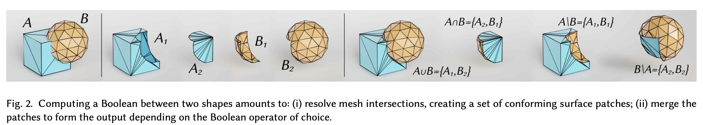

# Interactive and Robust Mesh Booleans

!!! quote "Reference Paper"
    **[Interactive and Robust Mesh Booleans](https://arxiv.org/abs/2205.14151)**

    **Date**: 26 May 2022

!!! Abstract
    Boolean operations are among the most used paradigms to create and edit digital shapes. Despite being conceptually simple, the computation of mesh Booleans is notoriously challenging. Main issues come from numerical approximations that make the detection and processing of intersection points inconsistent and unreliable, exposing implementations based on floating point arithmetic to many kinds of degeneracy and failure. Numerical methods based on rational numbers or exact geometric predicates have the needed robustness guarantees, that are achieved at the cost of increased computation times that, as of today, has always restricted the use of robust mesh Booleans to offline applications. We introduce the first algorithm for Boolean operations with robustness guarantees that is capable of operating at interactive frame rates on meshes with up to 200K triangles. We evaluate our tool thoroughly, considering not only interactive applications but also batch processing of large collections of meshes, processing of huge meshes containing millions of elements and variadic Booleans of hundreds of shapes altogether. In all these experiments, we consistently outperform prior art by at least one order of magnitude.

## Introduction

In many existing methods, the calculation of a mesh Boolean is framed as a two step process. In the first step, conflicts between mesh elements are resolved, splitting triangles in order to incorporate intersection lines in the connectivity. In the second step, each mesh element is deemed as being inside or outside each input object. The result of a Boolean is eventually computed as a subset of the mesh elements generated in the first step, flitered according to the inside/outside labeling computed in the second step. As shown in the figure below.

<figure markdown="span">
    {width="100%", loading=lazy}
</figure>

The major difficulty in implementing a Boolean pipeline comes from the use of finite precision arithmetic, which does not allow to exactly represent and test intersection points.

