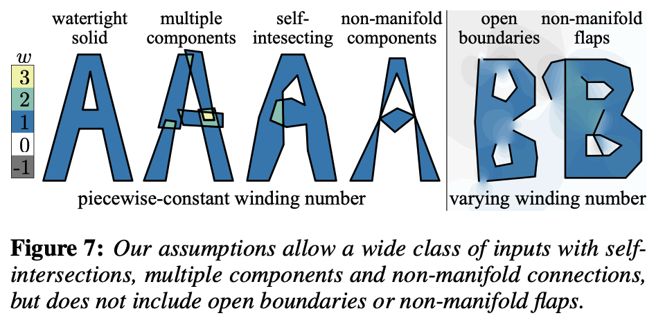
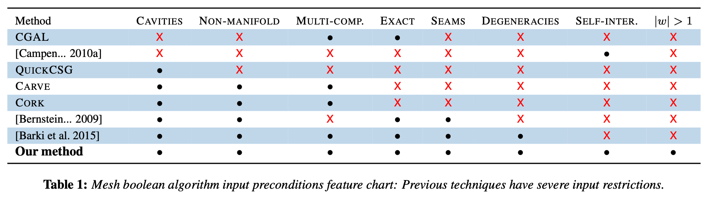
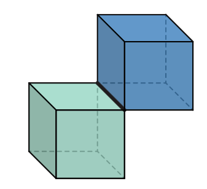
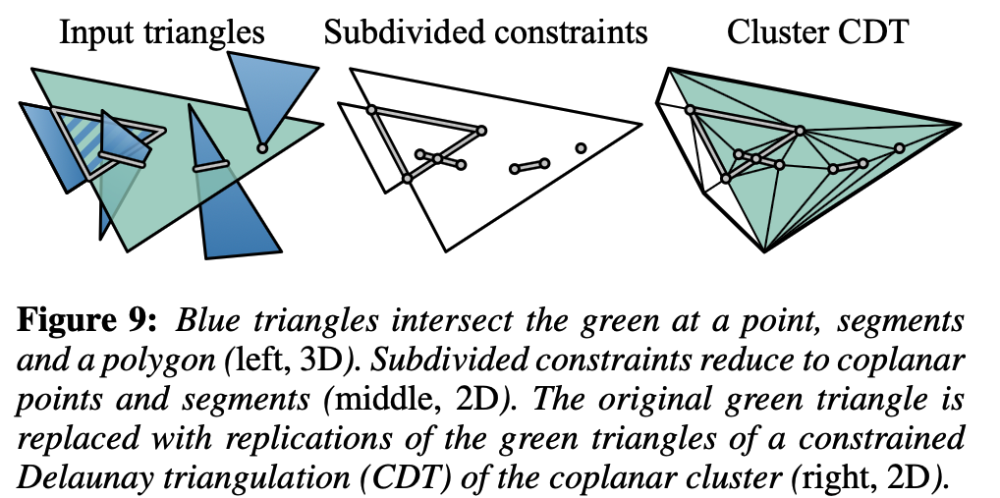

# Mesh Arrangements for Solid Geometry

!!! quote
    **[Mesh Arrangements for Solid Geometry](https://www.cs.columbia.edu/cg/mesh-arrangements/)**

    **date**: 2016

## 1 Introduction

### 1.1 Input Restrict

Our mesh arrangement constructed from a restricted class of meshes: those with *piecewise-constant winding number*, or PWN.

> By surveying 10,000 popular meshes, we found that PWN meshes cover a large fraction of pratically relevant situations.

<figure markdown="span">
    {width="70%", loading=lazy}
</figure>

<figure markdown="span">
    {width="100%", loading=lazy}
</figure>

### 1.2 Output Guarantee

Our method guarantees as output a *solid* mesh. Informally, a solid mesh is the non-degenerate boundary of a solid subregion of $\mathbb{R}^3$. Solid meshes are free of self-intersecions, degenerate triangles or duplicate triangles, and their generalized winding number field is either zero or one.

!!! note
    Note that even if the input meshes $\mathcal{A_1}$ and $\mathcal{A_2}$ are manifold polyhedra, the output of $\mathcal{C}=\mathcal{A}_1\cap\mathcal{A}_2$ may be a non-manifold solid mesh.

    <figure markdown="span">
        {width="50%", loading=lazy}
    </figure>

Our mehtod guarantees that the output is exact, i.e., interpreting the input positions as exact rationals, all intersections result from exact construction. The output coordinates may optionally be converted to floating point in a post-process.

## 2 Concepts

The crux of our method is construction of the mesh arrangement data structure, consisting of cells annotated with winding numbers, patches and their adjacency graph, that allows us to extract results of a variety of operations from the arrangement.

### 2.1 Piecewise-constant Winding Number meshes

We require that triangle meshes $\mathcal{A}_i$ induce a piecewise-constant integer *generalized winding number*(PWN) field $w_i$:

$$
w_i(\mathbf{p}) \in \mathbb{Z} \quad \forall \mathbf{p}\in \mathbb{R} \backslash |\mathcal{A}_i|
$$

where $|\mathcal{A}_i|$ denotes the union of all triangles of $|\mathcal{A}_i|$ viewed as point sets. For a triangle mesh, this is simply the sum of the signed solid angles $\Omega_t(\mathbb{p})$ of each oriented triangle $t$:

$$
w_i(\mathbf{p})=\frac{1}{4\pi}\sum_{t\in \mathcal{A}_i}\Omega_t(\mathbf{p})
$$

We call meshes with this property *piecewise-constant winding number meshes* or PWN meshes.

## 3 Algorithms

### 3.1 Intersection resolution

#### Preconditions

The input is an exact PWN mesh $\mathcal{A}$

#### Postconditions

The output is an exact PWN mesh free of self-intersections, co-incident vertices, and degenerate triangles, inducing exactly the same winding number field as the input mesh.

#### Algorithm

Self-intersection resolution consists of four steps: discard exactly zero area input triangles as they do not affect the winding number, compute the intersection between every pair of triangles, conduct a constrained Delaunay triangulation for every coplanar cluster of intersections, and extract and replicate subtriangles from each triangle's cluster's triangulation.

We consider all pairs of triangles $a$ and $b$ in $\mathcal{A}$. The intersection intersect $(a,b)$ between these triangles can be one of the following four cases: empty, a single point, a line segment, or a convex polygon.

<figure markdown="span">
    {width="70%", loading=lazy}
</figure>

We gather *clusters* of triangles connected via non-trivial co-planar intersections. By construction all triangles in a cluster share the same supporting plane. We compute a 2D constrained Delaunay triangulation(CDT) of the convex hull of each cluster.

We clean up by purging geometrically duplicate vertices, but duplicate triangles need to be retained at this stage, as their removal requires knowledge of the extraction function.

The result is a possibly non-manifold mesh with possible duplicate triangles, but no self-intersections.

### 3.2 Partitioning space into cells

#### Preconditions

The input mesh is PWN without degenerate triangles, self-intersections, and co-incident vertices.

#### Postconditions

The output is a bipartite directed graph encoding of cell-patch incidences. Each patch node has one incoming and one outgoing edge to cell nodes, representing the volumetric regions on the positive and negative sides of the (oriented) patch, respectively, which we call *above* and *below* cells.

### 3.3 Winding number labeling

#### Preconditions

The input is a valid cell-patch graph. The universal ambient cell is seeded with a known winding number vector; by default $\textbf{w}=[0,...,0]$, signifying that infinity lies *outside* all shapes. Instead of computing winding numbers geometrically, we use property that the winding number changes by $1$ or $-1$, whenever a surface is crossed, and thus can be computed by propagation along the cell-patch bipartite graph.

#### Postconditions

The output is a valid cell-patch data structure with consistently labeled winding number vector for each cell.
