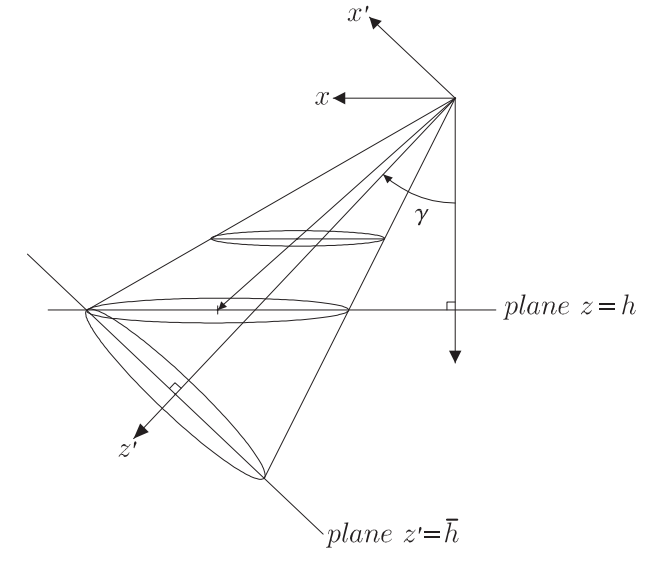
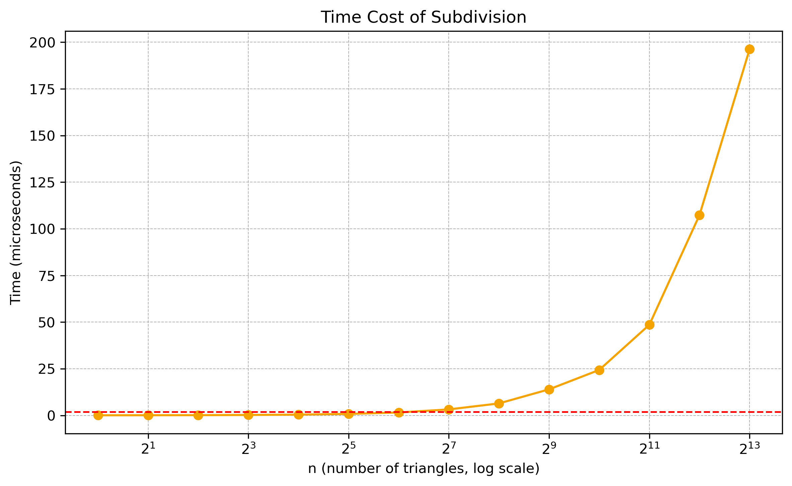
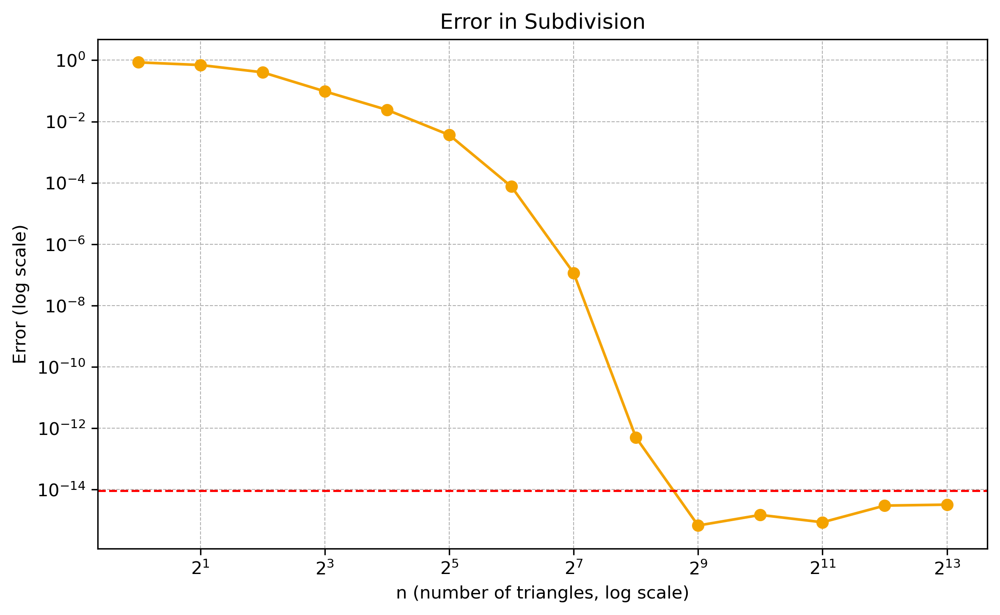

# Solid Angle of Ellipse
!!! quote "Related Papers"
    **[Analytical solution for the solid angle subtended at any point by an ellipse via a point source radiation vector potential](https://www.sciencedirect.com/science/article/abs/pii/S0168900209022918)**
## 1. Problem Description

Calculate the (signed) solid angle for an ellipse from the origin $(0,0,0)$

In short, complete the function s.t.
```c++
/**
 * @brief Computes the solid angle for an ellipse from the origin(0,0,0)
 *
 * @param c Center of the ellipse. R^3
 * @param n Normal vector of the ellipse. R^3
 * @param d Direction of the long axis. R^3  ensure that <n, d> = 0
 * @param a Semi-major axis length of the ellipse. R
 * @param b Semi-minor axis length of the ellipse. R ensure that a >= b >= 0
 * @return The solid angle in steradians.
 */
double solid_angle_ellipse(
    const Eigen::Vector3d &c,
    const Eigen::Vector3d &n,
    const Eigen::Vector3d &d,
    const double a,
    const double b
);
```

## 2. Math Expression Needed

### 2.1 Problem Simplify

We can assume that the Normal vector of the ellipse $\boldsymbol{n}$ is parallel to the z-axis and the direction of the long axis $\boldsymbol{d}$ is parallel to the x-axis, because it's easy to apply a coordinate transformation to satisfy this condition.

So, in the following expression, we assume that $\boldsymbol{n} = (0,0,1)$ and $\boldsymbol{d} = (1,0,0)$

Also, we assume that $\boldsymbol{c} = (p,q,h)$

### 2.2 Analytical solution for the coaxial case
It's easy to calculate the solid angle using the eletric field. As we suppose a point charge is placed at the origin, and the soliet angle problem can be transformed into a calculation of the electric flux.

So the answer is

$$
\Omega(a, b, h) = 2\pi \left(1 - \Lambda_0(\beta, k)\right) \tag{57}
$$

where

$$
\beta = \arcsin \sqrt{ \frac{h^2}{h^2 + b^2} } \tag{58}
$$

$$
k = \sqrt{\frac{a^2-b^2}{h^2+a^2}}
$$

and

$$
\Lambda_0(\beta,k) = \frac{2}{\pi}[\textbf{E}(k)F(\beta,k')+\textbf{K}(k)E(\beta,k)-\textbf{K}(k)F(\beta,k)]
$$

where $k' \equiv \sqrt{1-k^2}$
### 2.3 Analytical case related to sections of a right circular cone
We can apply a coordiante transformation such that, in the transformerd frame, the $z'$-axis is aligned with the direction from the ellipse center to the observation point, and the $x'$ axis is aligned with the ellipse's major axis.

After this transformation, the resulting elliptical cone can be characterized by its new effective semi-axes, which can then be used to compute the solid angle.

And here's the new axis length after transformation.

$$
\bar{a}^2 = a^2-h^2-p^2 + \sqrt{(p^2-a^2)^2+2h^2(p^2+a^2)+h^4}
$$

$$
\bar{b}^2 = 2b^2
$$

$$
\bar{h}^2 = h^2+p^2-a^2 + \sqrt{(p^2-a^2)^2+2h^2(p^2+a^2)+h^4}
$$

and then, we can apply the conclusion of **Chapter 2.2** to calculate the answer, but here's the point, in this occasion, we're not sure that if $a > b$ or $a < b$, so, we should first swap $a$ and $b$ if $a < b$ before apply the conclusion.
### 2.4 General Solution
#### 2.4.1 Rotation of the coordiante system



In the $(x,y,z)$ coordinate system, the sheared core obeys the equation

$$
    \left(\frac{x}{a} - \frac{pz}{ah}\right)^2 +
    \left(\frac{y}{b} - \frac{qz}{bh}\right)^2 -
    \left(\frac{z}{h}\right) = 0
    \tag{117}
$$

we need to rotate the coordinate system $(x,y,z)$ to $(x',y',z')$ where the $z'$ axis lies along the center line of the right elliptic cone.

This rotation need a right-handed rotation by an angle $\gamma$ about the $y$-axis to give a new coordinate system $(\hat{x},\hat{y},\hat{z})$ and a additional right-handed rotation by an angle $\psi$ about the $\hat{x}$ axis to give the new coordinate system $(x',y',z')$

Then, we get

$$
\begin{bmatrix}
  x'\\
  y'\\
  z'
\end{bmatrix} =
\begin{bmatrix}
1 & 0 & 0 \\
0 & \cos\psi & \sin\psi \\
0 & -\sin\psi & \cos\psi
\end{bmatrix}
\begin{bmatrix}
\cos\gamma & 0 & -\sin\gamma \\
0 & 1 & 0 \\
\sin\gamma & 0 & \cos\gamma
\end{bmatrix}
\begin{bmatrix}
x \\
y \\
z
\end{bmatrix}
\tag{119}
$$

Substituting Eq.(119) into Eq.(117), expanding and collecting terms gives

$$
A_1x'^2 + B_1x'y' + C_1y'^2+D_1x'+E_1y'=F_1
\tag{121}
$$

where

$$
A_1 = \frac{1}{a^2} + A \sin^2\gamma + B \sin 2\gamma
$$

$$
B_1 = 2C \sin\gamma \cos\psi - 2B \cos 2\gamma \sin\psi - A \sin 2\gamma \sin\psi
$$

$$
C_1 = \frac{\sin^2 \psi}{a^2} + \frac{\cos^2 \psi}{b^2} - B \sin 2\gamma \sin^2 \psi - C \cos\gamma \sin 2\psi + A \cos^2\gamma \sin^2 \psi
$$

$$
D_1 = -(A \sin 2\gamma \cos\psi + 2B \cos 2\gamma \cos\psi + 2C \sin\gamma \sin\psi) z'
$$

$$
E_1 = \left(D \sin 2\psi - B \sin 2\gamma \sin 2\psi + A \cos^2 \gamma \sin 2\psi - 2C \cos\gamma \cos 2\psi \right) z'
$$

$$
F_1 = \left( B \sin 2\gamma \cos^2 \psi - \frac{\cos^2 \psi}{a^2} - \frac{\sin^2 \psi}{b^2} - A \cos^2 \gamma \cos^2 \psi - C \cos\gamma \sin 2\psi
\right) z'^2
$$

and where

$$
A = \frac{p^2}{a^2 h^2} + \frac{q^2}{b^2 h^2} - \frac{1}{a^2} - \frac{1}{h^2}
$$

$$
B = \frac{p h}{a^2 h^2}
$$

$$
C = \frac{q h}{b^2 h^2}
$$

$$
D = \frac{1}{a^2} - \frac{1}{b^2}
$$

#### 2.4.2  Solution for the rotation angle
For the $z'$ axis to lie along the axis of the cone, the coefficients $D_1$ and $E_1$ must vanish simultaneously and hence

$$
A \sin 2\gamma + 2B \cos 2\gamma + 2C \sin\gamma \tan\psi = 0
$$

$$
\left(D - B \sin 2\gamma + A \cos^2 \gamma \right) \tan 2\psi - 2C \cos\gamma = 0
$$

After solving the system of equations, we get

$$
\gamma_j = \arctan(w_j)
$$

$$
\psi_j = -\arctan\left( \frac{A \sin 2\gamma_j + 2B \cos 2\gamma_j}{2C \sin \gamma_j} \right)
$$

where $w_j$, $j \in {1,2,3}$ is the three roots of the function

$$
w^3 - \left( \frac{A}{B} + \frac{B}{D} + \frac{C^2}{BD} \right) w^2 + \left( \frac{A}{D} - 1 \right) w + \frac{B}{D} = 0
$$

> it is proved from the geometry that all three roots are real number.

only one root that satisfied $B_1^2-4A_1C_1 < 0$ is the correct root that needed.

#### 2.4.3 Equation of the ellipse in canonical form

The value of $z'$ in Eq.(127) for $F_1$ is arbitrary and can be conveniently set to unity.

Since $E_1$ and $F_1$ is zero now, we can apply another right-handed rotation by an angle $\lambda$ about the $z'$ axis to set $B_1$ to zero.

We denoting the new rotated coordinates by $(\bar{x},\bar{y},\bar{z})$, then do the same steps of the previous part.

Then, we can get the final equation of the ellipse in the form

$$
A_2\bar{x}^2+C_2\bar{y}^2=F_1
$$

where

$$
A_2 = \frac{A_1 + C_1 + \operatorname{sgn}(A_1 - C_1) \sqrt{B_1^2 + (A_1 - C_1)^2}}{2}
$$

and

$$
C_2 = \frac{A_1 + C_1 - \operatorname{sgn}(A_1 - C_1) \sqrt{B_1^2 + (A_1 - C_1)^2}}{2}
$$

as the equation of Eq.(57), we can get the **final solid angle** which is equal to 

$$
\Omega \left( \sqrt{\frac{F_1}{A_2}}, \sqrt{\frac{F_1}{C_2}} \right)
$$

## 3. Results

### 3.1 time Complexity



The horizontal axis repersents the number of triangles used to divide the ellipse in the numerical intergration, while the vertical axis shows the average time required to compute the solid angle. The orange curve correspoinds to the numerical-integration approach, whereas the red dashed line denotes the analytical formula($1.9123\mu s$).

### 3.2 computational error



**The error was determined by comparing our results with those reported in the paper, which are accurate to 20 significant digits**
The horizontal axis repersents the number of triangles used to divide the ellipse in the numerical intergration, while the vertical axis shows the average error in the calculated solid angle. The orange curve correspoinds to the numerical-integration approach, whereas the red dahed line denotes the analytical formula($9.20974e-15$).

**summery table**

| N    | Time (μs)  | Error              |
|:------|:------------|:--------------------|
| 1    | 0.0798565  | 8.52715e-01        |
| 2    | 0.101816   | 6.97061e-01        |
| 4    | 0.144651   | 4.03314e-01        |
| 8    | 0.247237   | 9.64311e-02        |
| 16   | 0.426442   | 2.40481e-02        |
| 32   | 0.814843   | 3.64688e-03        |
| 64   | 1.57491    | 7.55273e-05        |
|**analytical fomula**| **1.9123** | **9.20974e-15** | 
| 128  | 3.22987    | 1.14700e-07        |
| 256  | 6.43509    | 5.02762e-13        |
| 512  | 13.982     | 6.69005e-16        |
| 1024 | 24.3732    | 1.48253e-15        |
| 2048 | 48.5727    | 8.52766e-16        |
| 4096 | 107.324    | 2.98612e-15        |
| 8192 | 196.24     | 3.20553e-15        |

### 3.3 accelerate
if we disable the elliptic integral promotion to long double, we can get the table following

| n    | Time (μs)  | Error              |
|:------|:------------|:--------------------|
| 1    | 0.0564791  | 8.22507e-01        |
| 2    | 0.0774804  | 1.13996e+00        |
| 4    | 0.126105   | 3.63865e-01        |
| 8    | 0.223437   | 1.16768e-01        |
|**analytical fomula**|**0.314463**| **9.25467e-15**|
| 16   | 0.413136   | 2.40539e-02        |
| 32   | 0.763126   | 3.72579e-03        |
| 64   | 1.57758    | 7.52979e-05        |
| 128  | 3.1183     | 1.14699e-07        |
| 256  | 6.22602    | 5.03033e-13        |
| 512  | 13.5295    | 8.50134e-16        |
| 1024 | 24.4535    | 1.18320e-15        |
| 2048 | 49.7387    | 1.77492e-15        |
| 4096 | 127.653    | 2.76455e-15        |
| 8192 | 209.726    | 3.45533e-15        |


if we disable the elliptic integral promotion to double, we can get the table following.
But for some extreme samples, analytical fomula error would goto **1e-5**, which will maybe not be accpeted.

| n    | Time (μs)  | Error              |
|------|------------|--------------------|
| 1    | 0.050011   | 8.22507e-01        |
| 2    | 0.0698501  | 1.13996e+00        |
| 4    | 0.134739   | 3.63865e-01        |
|**analytical fomula**|**0.186762**| **5.19641e-07**|
| 8    | 0.230931   | 1.16768e-01        |
| 16   | 0.435317   | 2.40539e-02        |
| 32   | 0.826416   | 3.72579e-03        |
| 64   | 1.66177    | 7.52979e-05        |
| 128  | 3.26956    | 1.14699e-07        |
| 256  | 6.37945    | 5.03033e-13        |
| 512  | 12.6507    | 8.50134e-16        |
| 1024 | 24.9748    | 1.18320e-15        |
| 2048 | 50.179     | 1.77492e-15        |
| 4096 | 100.874    | 2.76455e-15        |
| 8192 | 202.717    | 3.45533e-15        |
